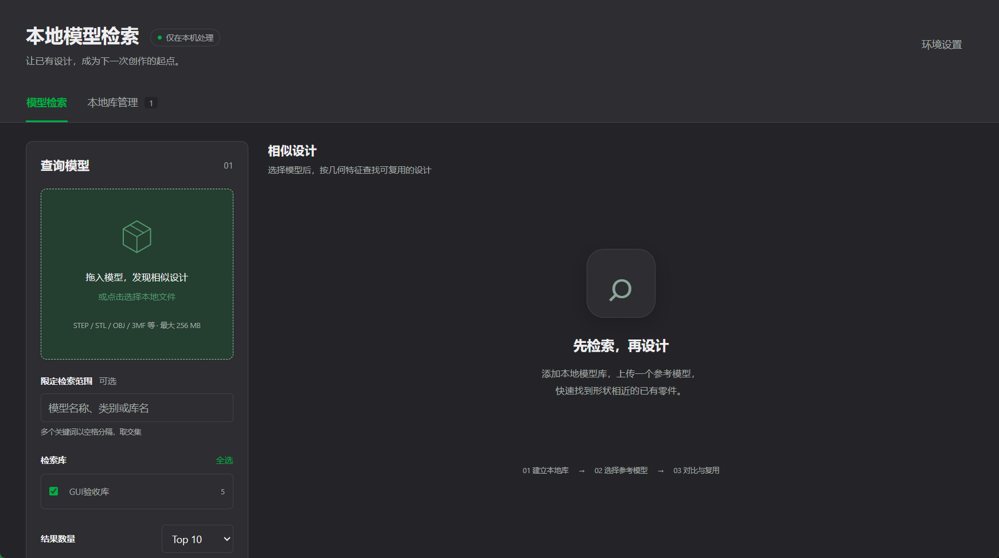

# 本地模型检索 · Local Model Search

> **让已有设计，成为下一次创作的起点。**
> 在你的电脑上建立 3D 模型「形状检索库」：拖入一个模型，即可按几何形状找到相似的已有设计。
> 全程本地计算，模型与特征不出本机。



> 独立检索软件，无需安装 Bambu Studio；本仓库不包含完整切片软件。

## 下载安装包

[打开 Releases 下载 Windows / Mac 安装包](https://github.com/pipi123456798/local-model-search/releases)

| 平台 | 下载文件 | 安装方式 |
| --- | --- | --- |
| Windows 10/11 x64 | `LocalModelSearch-<版本>-Windows-x64-Setup.exe` | 双击安装，开始菜单启动 |
| Windows 便携版 | `LocalModelSearch-<版本>-Windows-x64-Portable.zip` | 完整解压，双击 `LocalModelSearch.exe` |
| macOS 14+，M 系列 | `LocalModelSearch-<版本>-macOS-arm64.dmg` | 将应用拖入 Applications |

安装包内置 Python、CPU 推理依赖、Shape 权重和预览资源，首次启动不会安装 pip 依赖或下载权重。请以 Release 实际附件和验收说明为准；缺少附件表示该平台尚未完成构建，不要把 GitHub 的 Source code ZIP 当作安装包。Mac 在完成实机 GUI 与 Gatekeeper 验收前仅提供预发布测试资产。

---

## ✨ 它能做什么

| 能力 | 说明 |
| --- | --- |
| 🗂 建立本地检索库 | 选择一个包含 3D 模型的文件夹，自动建立形状索引（可多库并存） |
| 🔍 按形状检索 | 拖入 STEP / STL / OBJ / 3MF / PLY / GLB 等模型，按形状相似度排序返回 Top-K |
| 🧭 3D 预览 | 查询与结果均可本地交互预览（three.js 渲染），支持「以此模型继续检索」 |
| 🗃 库管理 | 刷新索引、浏览模型、移除库、打开所在文件夹 |
| ✏️ 在 CAD 中打开编辑 | 检索结果可直接交给本机已安装的 CAD 程序修改（创建副本编辑 / 直接编辑原文件）；本机有多个可打开程序时可选择 |
| 🔒 全程离线 | 服务仅监听 `127.0.0.1`（带随机会话令牌）；完整安装包下载后无需联网 |

检索原理：深度学习 Shape 特征（GAOT 骨干网，128 维形状嵌入）+ 余弦相似度。

## 🚀 安装与首次启动

### Windows 10 / 11 x64

1. 双击 `*-Windows-x64-Setup.exe`，按向导安装到当前用户目录，无需管理员权限。
2. 从开始菜单或桌面快捷方式启动，等待启动进度结束。关闭应用窗口即退出后台服务。

便携 ZIP 必须完整解压，不能只复制 EXE 或在压缩包内运行。独立窗口不可用时会打开系统浏览器，并保留带“退出”按钮的控制窗口；仅关闭浏览器标签页不会结束后台。

### macOS 14+（Apple Silicon / M 系列）

1. 打开 `*-macOS-arm64.dmg`，将 `LocalModelSearch.app` 拖入 Applications。
2. 从 Applications 启动，不在 DMG 内保存用户数据。

首版不支持 Intel Mac、Windows ARM，不承诺 GPU 加速。Mac 的 CI 产物测试不等于 Finder、文件选择器和 Gatekeeper 的实机验收。

### 安全提示

当前未配置开发者签名凭据：Windows 包未作正式代码签名；Mac 使用 ad-hoc 签名，未经 Apple 公证，因此系统可能阻止首次打开。

请只从本仓库 Release 下载，先核对同页 `SHA256SUMS-*.txt`（Windows 可用 `Get-FileHash`，Mac 可用 `shasum -a 256`）。确认来源后按系统为该应用提供的选项继续；Mac 可查看“系统设置 → 隐私与安全性”的具体提示。不要关闭 SmartScreen、Gatekeeper、防病毒或全局安全机制；遇到“损坏”“恶意软件”等警告应停止并反馈。

### 源码运行（仅开发者）

源码仍需自行准备 Python 和依赖，推荐 Python 3.11：

```bash
python scripts/setup.py    # 联网准备 .venv、依赖和固定版本权重
# Windows
.venv\Scripts\python.exe app\launcher.py
# macOS
.venv/bin/python app/launcher.py
```

`Start-Windows.bat`、`Start-Mac.command` 仅保留为源码入口。离线准备权重可运行 `python scripts/fetch_kit.py --archive shape-kit.zip`，脚本只安装通过 SHA-256 校验的权重，不覆盖 Python 代码。

## 📋 系统要求

| 项目 | 要求 |
| --- | --- |
| 操作系统 | Windows 10/11（x64）；macOS 14+（Apple Silicon） |
| Python | 安装包已内置；不需要系统 Python |
| 磁盘空间 | 建议预留至少 5 GB；模型和索引另计 |
| 内存 | 建议 8 GB 及以上 |
| 网络 | 下载安装包及更新时需要；推理和预览可离线 |
| 独立窗口 | Windows 使用系统 WebView，缺失时回退浏览器；Mac 使用系统 WebKit |

## 🖱 使用说明

1. **建立检索库**：「新建检索库」→ 选择一个放有 3D 模型的文件夹 → 等待索引完成
2. **检索相似模型**：把查询模型拖入左侧卡片（或点击选择本地文件）→ 点「查找相似模型」
3. **查看结果**：点击结果 3D 预览；「打开所在文件夹」定位到磁盘位置；「以此模型继续检索」做二跳搜索；「在 CAD 中打开编辑」直接调起本机 CAD 程序修改
4. **库管理**：左侧「本地库管理」可刷新索引、浏览模型、移除库

支持格式：`STEP/STP`、`STL`、`OBJ`、`3MF`、`PLY`、`GLB/GLTF`、`OFF`；单个文件最大 256 MB。

## ❓ 常见问题

<details>
<summary>为什么提示找不到 Python？</summary>

你可能下载了源码 ZIP。普通用户请下载带 `Setup.exe`、`Portable.zip` 或 `.dmg` 的附件，它们不需要系统 Python。
</details>

<details>
<summary>macOS 提示“无法打开，因为无法验证开发者”？</summary>

Mac 应用尚未经开发者签名和 Apple 公证。请先核对下载来源与校验值，再查看系统“隐私与安全性”针对该应用的提示；不要关闭全局安全机制。
</details>

<details>
<summary>启动失败，日志在哪里？</summary>

点击“配置与日志”，或使用开始菜单的 Configuration and logs。主进程日志为用户数据目录下 `startup.log`，后台日志在 `sessions/<会话>/launcher.log`。反馈日志前请隐藏个人路径和会话令牌，不要上传整个用户数据目录。
</details>

<details>
<summary>会不会有防火墙或安全提示？</summary>

服务仅监听 `127.0.0.1` 并带随机会话令牌，不需要向公网或局域网开放入站端口。无需关闭防火墙。未签名应用可能触发系统安全提示，详见上文。
</details>

<details>
<summary>如何更新 / 卸载？</summary>

- 更新：退出应用，备份用户数据，再运行新版 Windows 安装程序；便携版解压到新目录，Mac 替换 Applications 中的应用。
- 卸载：Windows 在系统“已安装的应用”中卸载；便携版删除程序目录；Mac 移除 `.app`。
- 升级和卸载默认保留独立用户目录下的配置和索引，不会删除源模型。
</details>

## 用户数据与旧版本迁移

- Windows：`%LOCALAPPDATA%\LocalModelSearch`
- Mac：`~/Library/Application Support/LocalModelSearch`
- 配置：上述目录内的 `config.json`；改动后重启生效。便携版也使用此目录。
- 旧版本的项目 `data/` 不会自动搬移或删除。关闭旧程序，在新界面点击“导入旧检索库”，选择含 `registry.json` 的旧 `data` 文件夹；仅复制索引，目标已有库时拒绝覆盖。
- 不复制旧会话或配置；CAD 程序路径需重新设置。原模型路径必须继续存在，特征版本变更时按提示刷新索引。
- 只有确认不再需要时才手动移除用户数据；卸载不自动执行此操作。

## 🧩 源码目录结构

```
├─ Start-Windows.bat          # Windows 一键启动
├─ Start-Mac.command          # macOS 一键启动
├─ config.json                # 可选配置（端口 / 设备 / 镜像源等）
├─ requirements.txt           # Python 依赖清单
├─ app/
│  ├─ launcher.py             # 启动器（会话、令牌、浏览器）
│  ├─ model_search/           # 本地服务（Flask，仅回环）
│  └─ web/model_search/       # 前端页面（three.js + 原生桥接）
├─ scripts/
│  ├─ setup.py                # 环境准备（虚拟环境 / 依赖 / 权重）
│  ├─ fetch_kit.py            # 权重包下载与校验（断点续传）
│  └─ setup_windows.ps1       # Windows 侧 Python 探测
├─ docs/                      # GitHub Pages 说明页
└─ packaging/make_release.py  # 维护者：构建发布资产
```

## 🔧 可选配置（config.json）

| 键 | 默认 | 说明 |
| --- | --- | --- |
| `port` | `0` | 服务端口；`0` = 自动选择空闲端口 |
| `device` | 安装包为 `cpu` | 首版以 CPU 推理验收，不承诺 GPU 加速 |
| `open_browser` | `true` | 就绪后自动打开浏览器 |
| `window` | `auto` | 独立窗口优先；`browser` 强制使用浏览器 |
| `cad_exe` | `""` | 本机 CAD 可执行文件；留空使用系统文件关联 |
| `kit` / `checkpoint` | `""` | 自定义权重包目录 / 权重文件路径 |

## 发布构建（维护者）

在对应平台使用 Python 3.11 创建独立环境（不要加 `--system-site-packages`）：

```bash
python -m venv build/venv
# Windows PowerShell
.\build\venv\Scripts\Activate.ps1
# macOS
source build/venv/bin/activate
```

随后安装依赖、准备已校验权重并构建：

```bash
# 仅 Windows：先从官方 CPU 源安装 torch
python -m pip install torch==2.14.0 --index-url https://download.pytorch.org/whl/cpu
python -m pip install -r packaging/requirements-build.txt
python scripts/fetch_kit.py --archive shape-kit.zip
# 仅 Windows：下载并核对固定 SHA-256 后准备项目内 Inno Setup
python packaging/prepare_inno.py
python -m pytest tests -q --basetemp build/pytest
python packaging/build_app.py --version 1.1.0
```

无需激活时，可将 `python` 替换为环境内的完整解释器路径。Mac 不执行上述两个 Windows 专用步骤。
构建器拒绝全局环境、依赖版本漂移和标准 OCP／VTK 混装。Windows 默认使用 `.tools/inno/ISCC.exe`，也可用 `--iscc` 指定编译器；`--zip-only` 仅生成便携包。`prepare_inno.py --archive <官方安装程序>` 可离线准备编译器；仅下载连接异常时可加 `--no-proxy`，不会关闭 TLS 校验或修改系统代理。编译器以当前用户方式安装，不修改系统 PATH。

构建先验证权重和依赖来源，再收集许可材料、冻结程序、运行真实离线自测，最后生成安装包及 SHA-256 清单。自动收集 METADATA 不代表所有原生 DLL 的再分发审核已完成；公开发布前仍须核对完整许可证、归属和所需对应源码。

GitHub Actions：先将指定源码提交打标签并创建同名草稿 Release，上传 `shape-kit.zip`，再手动运行构建工作流。构建结果默认只保留为 CI 验收附件。完成该版本的原生依赖分发核查后，维护者才能把仓库变量 `NATIVE_DISTRIBUTION_APPROVED_TAG` 设置为对应标签；未设置或不匹配时不会写入 Release，即使勾选公开发布也不会绕过。Windows 和 Mac 均成功且该标签获准后才附加平台资产；只有显式勾选发布选项才公开为预发布。Mac 未经实机验收不能标记为正式稳定版。失败任务不能作为可用安装包发布。

## ⚖️ 许可与致谢

- 原创部分使用 **MIT License**；Shape 源码和权重为 **Apache-2.0**，其他依赖遵守各自许可证
- 3D 预览使用 [three.js](https://threejs.org/)（MIT）
- 本项目为独立社区工具，**与 Bambu Lab 无隶属关系**；第三方组件与商标说明详见 [NOTICE.md](NOTICE.md)
